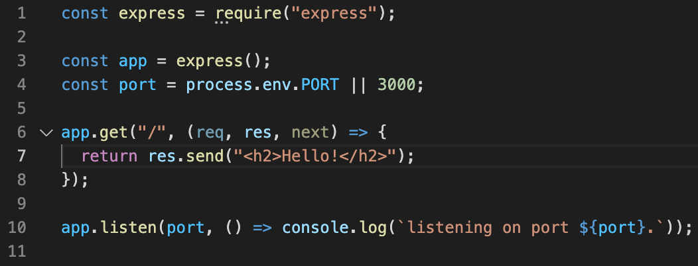
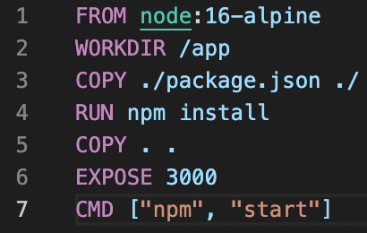

# Getting Started with Docker for Node Development

Author: Jesse Brink

Author GitHub username: @JB0925

Author  LinkedIn: https://www.linkedin.com/in/jesse-brink-0682/

Date: 16 January 2022

Keywords: Docker, Node.js, Deployment, beginner, tutorial

## Table Of Contents

1. [Overview](#overview)
2. [Examples And Implementations](#examples-and-implementations)
3. [Summary](#summary)
4. [Additional Resources And Citations](#additional-resources-and-citations)

---

## Overview

    This article intends to teach the reader how to build a Docker image and run a container using a simple Node.js app. It is intended for someone with no prior experience with Docker. Before attempting the steps in this article, please make sure that you have Docker Desktop installed on your machine. You can do so by doing the following:
        - Head over to [www.docker.com/get-started]](https://docker.com/get-started)
        - Scroll down and choose the correct version of Docker Desktop for your machine.
        - Go through the setup process and be sure to sign up for an account.

---

## Examples And Implementations

    Docker is a tool that makes it easy to deploy and run applications inside of a container. They can be deployed almost anywhere. For these reasons, Docker has become very popular over the past several years.

    In this article, I will show you how to "dockerize" a simple Node.js app.

    Let's get started by setting up our Node.js app. This will be very basic, as the real goal here is to learn how to build a Docker image and run a container.

    ### Creating a Node.js App

    In your terminal, create a new diretory called `docker-app`. Inside of that, run the command `npm init -y`. This will skip the configuration options offered by Node.js because, again, we want to keep our focus on Docker.

    Following that step, run `npm install express`. Express is the web framework that we will be using for this simple app.

    Please see the screenshot below for the code used to setup the Node.js / Express app.

    

    For this simple app, the file is named `index.js` and is located in the project's root directory.

    Very briefly, what we have done in the code above is created an app using express and created one route, a GET route, that will return an HTML h2 element that says "Hello!". We then set our app to listen for web traffic at the port specified in the `port` variable.

    If you run the command `node index.js`, you will start the server. Then, in your browser, go to `localhost:3000` and you will see the "Hello!" h2 on the page.

    ### Building an Image for Our App with Docker

    To build a Docker image for our app, we will create a `Dockerfile`. This can be created in the project's root directory as well, for the sake of simplicity.

    Please note that the file must be called Dockerfile, with an uppercase D.

    The first thing we need is a base image. A base image is used to create your container image. Our base image comes with Node.js already installed, which is why we are choosing it. Base images can be found at [Docker Hub](https://hub.docker.com). Once there, use the search bar and search for `Node`. Here, we will use one of the many Node base images. In the first line of your Dockerfile, write `FROM node:16-alpine`.

    Following that, we will set the working directory with the WORKDIR command. The working directory is where commands such as RUN, CMD, etc., will be executed inside of the container. We will keep ours simple! On line two of your Dockerfile, it should say `WORKDIR /app`.

    The next few steps may seem out of order. They are:
        `COPY ./package.json ./
         RUN npm install
         COPY . .`

    Often, your package.json file does not change from build to build, and therefore Docker will see that nothing has changed in that file. If that is the case, it will be able to skip over the `COPY ./package.json ./` line, as well as the `RUN npm install` line. This makes a new build (after the first one) complete faster.

    We have almost completed our first Dockerfile. The next step is to write `EXPOSE 3000`. This tells other developers what port to use when running a container, but does not actually open the port for traffic. More on that in a minute. One more thing to keep in mind is that, if this were a more complicated Node project, you might have environment variables, such as the port, etc. These can also be specified, but we will skip over that for now to keep things simple.

    Lastly, we need a run command. Type `CMD ["node", "index.js"]. This is the command that will be run inside of the container to start the application.

    For reference, the picture below shows what our Dockerfile should look like at this point.

    

    ### Using Docker Build and Docker Run Commands

    If you've made it this far, you are ready to build and run your first container! Let's start with `docker build`. When you run `docker build`, you are building a Docker image from a Dockerfile.

    To build our image, we will run the command `docker build -t yourDockerUsername/yourProjectName:latest .` NOTE: Don't forget the period at the end! It is specifying the current directory for the build process. The purpose of the -t flag is to "tag" our image, i.e. give it a name. This makes the next step easier.

    We are now ready to run a container based on the image we've created! To do this, there are many flags that can be passed into the basic command that have various different effects, but we will stick with one for now. The -p flag actually opens up ports locally and inside the container for web traffic, so it is necessary to use it if we actually want to use our app and see the "Hello!" that we've worked so hard to create!

    Here is the run command: `docker run -p 3000:5000 yourDockerUsername/yourProjectName`.

    3000 is the port that we will visit on our machine, and 5000 is the port we are opening inside of the container.

    Congratulations, you've created your first Docker image and run your first container! Open up a web browser and go to localhost:3000. You should see your "Hello!" text appear in browser.

    ### Stopping the container

    To stop the container, open up another terminal window and type the command `docker ps` Look for the container ID. It should be the first column, and it should look something like "a734dcae45g78d". Copy that line and then, in your terminal, run `docker stop a734dcae45g78d`. This will bring down the container that you are currently running.

---

## Summary

    Thanks for taking the time to read and work through this Intro to Docker tutorial! As a recap, in this tutorial we:
        - set up a basic Node.js / Express app
        - created a Dockerfile
        - built an image using the Dockerfile
        - ran a container from the image we built
        - learned how to stop the running container

    I hope that you have learned a lot and are now ready to take the next step in your journey with Docker.

---

## Additional Resources And Citations

    Below are some resources that I used and learned a lot from while learning about Docker:
        - Docker and Kubernetes: The Complete Guide by Stephen Grider
        - [`Learn Docker - DevOps with Node.js and Express](https://www.youtube.com/watch?v=9zUHg7xjIqQ)
